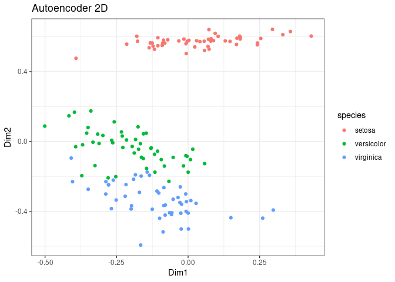

<!-- README.md is generated from README.Rmd. Please edit that file -->

# NeuralNetworkNMDS

<!-- badges: start -->
<!-- badges: end -->

The goal of NeuralNetworkNMDS is to show how you can use neural networks
in order to achieve a similar process to the one used in NMDS, that is
take a n-dimensional data set and reduce it to n-k dimensions, typically
two or three for graphing purposes.

``` r
library(h2o)
library(vegan)
library(dplyr)
library(ggplot2)
```

## Example 1 Iris dataset

we will use as a first example the iris dataset, for this we will use
all columns except for the species and then plot it using ggplot2:

``` r
Data <- iris |> 
  dplyr::select(-Species) |> 
  dplyr::mutate_if(is.numeric, scale) |> 
  as.data.frame() |> 
  dplyr::mutate_all(as.numeric)
```

Now we use an autoencoder

``` r
# Define the autoencoder model
# Initialize the H2O cluster
h2o.init()
#> 
#> H2O is not running yet, starting it now...
#> 
#> Note:  In case of errors look at the following log files:
#>     /tmp/Rtmpe6I5qC/file3e8198510a5c/h2o_au687614_started_from_r.out
#>     /tmp/Rtmpe6I5qC/file3e819207f00d0/h2o_au687614_started_from_r.err
#> 
#> 
#> Starting H2O JVM and connecting: ... Connection successful!
#> 
#> R is connected to the H2O cluster: 
#>     H2O cluster uptime:         2 seconds 827 milliseconds 
#>     H2O cluster timezone:       Europe/Copenhagen 
#>     H2O data parsing timezone:  UTC 
#>     H2O cluster version:        3.44.0.3 
#>     H2O cluster version age:    5 months and 30 days 
#>     H2O cluster name:           H2O_started_from_R_au687614_daj866 
#>     H2O cluster total nodes:    1 
#>     H2O cluster total memory:   3.83 GB 
#>     H2O cluster total cores:    8 
#>     H2O cluster allowed cores:  8 
#>     H2O cluster healthy:        TRUE 
#>     H2O Connection ip:          localhost 
#>     H2O Connection port:        54321 
#>     H2O Connection proxy:       NA 
#>     H2O Internal Security:      FALSE 
#>     R Version:                  R version 4.4.0 (2024-04-24)
```

``` r

# Convert to H2O frame
data_h2o <- as.h2o(Data)
#>   |                                                                              |                                                                      |   0%  |                                                                              |======================================================================| 100%
```

``` r

# Define the autoencoder model
autoencoder <- h2o.deeplearning(
  x = names(data_h2o),
  training_frame = data_h2o,
  autoencoder = TRUE,
  hidden = c(10, 2, 10),  # hidden layers, with 2 as the bottleneck layer
  activation = "Tanh",
  epochs = 50
)
#>   |                                                                              |                                                                      |   0%  |                                                                              |======================================================================| 100%
```

``` r

# Get the lower-dimensional representation (the bottleneck layer)
encoded_data_h2o <- h2o.deepfeatures(autoencoder, data_h2o, layer = 2)
#>   |                                                                              |                                                                      |   0%  |                                                                              |======================================================================| 100%
```

``` r

# Convert to a data frame for plotting
encoded_data <- as.data.frame(encoded_data_h2o)
colnames(encoded_data) <- c("Dim1", "Dim2")

h2o.shutdown(prompt = FALSE)

encoded_data$species <- iris$Species
```

now we can visalize this

``` r
ggplot(encoded_data, aes(x = Dim1, y = Dim2, color = species)) + geom_point()
```

<!-- -->

Using an autoencoder (or a neural network-based approach) for
dimensionality reduction has several advantages over Non-metric
Multidimensional Scaling (NMDS), particularly for certain types of data
and applications. Here are some of the key advantages:

1.  **Handling Non-linear Relationships:**
    - **Autoencoder:** Neural networks, including autoencoders, are
      powerful in capturing complex, non-linear relationships within the
      data. They can model intricate patterns that linear or simpler
      non-linear techniques might miss.
    - **NMDS:** NMDS is designed to preserve the rank order of distances
      between points in the reduced dimensionality space, which works
      well for capturing the general structure of data but may struggle
      with highly non-linear relationships.
2.  **Scalability:**
    - **Autoencoder:** Neural networks can be scaled to handle large
      datasets efficiently using modern hardware accelerations like
      GPUs. This makes autoencoders suitable for high-dimensional and
      large-scale data.
    - **NMDS:** NMDS can become computationally expensive and slow as
      the number of data points and dimensions increases, making it less
      suitable for very large datasets.
3.  **Feature Learning:**
    - **Autoencoder:** Autoencoders can learn meaningful features
      directly from the data without explicit feature engineering. The
      hidden layers can capture various levels of abstraction, leading
      to a more informative lower-dimensional representation.
    - **NMDS:** NMDS focuses solely on preserving the distance
      (dissimilarity) structure and does not learn new features or
      representations of the data.
4.  **Flexibility and Customization:**
    - **Autoencoder:** Neural networks offer flexibility in terms of
      architecture (number of layers, types of layers, activation
      functions, etc.), which can be tailored to the specific
      characteristics of the data and the requirements of the problem.
    - **NMDS:** NMDS has fewer parameters to tune and is less flexible
      in adapting to specific data characteristics beyond choosing the
      number of dimensions.
5.  **Integration with Deep Learning Frameworks:**
    - **Autoencoder:** Autoencoders can be easily integrated with other
      deep learning frameworks and methods. This integration allows for
      further extensions, such as combining with supervised learning
      tasks, anomaly detection, or generating new data samples.
    - **NMDS:** NMDS is primarily used as a standalone technique for
      dimensionality reduction and visualization and is not typically
      integrated into broader machine learning pipelines.
6.  **Data Reconstruction:**
    - **Autoencoder:** An autoencoder can be used not only for
      dimensionality reduction but also for data reconstruction. The
      decoder part of the autoencoder reconstructs the input data from
      its lower-dimensional representation, which can be useful for
      tasks like denoising or anomaly detection.
    - **NMDS:** NMDS does not provide a mechanism for reconstructing the
      original data from the reduced dimensions.

### Summary

While NMDS is a powerful and interpretable method for dimensionality
reduction, particularly suited for preserving the rank order of
dissimilarities, autoencoders offer a more flexible, scalable, and
powerful approach, especially for complex, high-dimensional, and
non-linear data. Autoencoders are also more adaptable to integration
within larger machine learning and deep learning frameworks. However,
the choice between NMDS and autoencoders should be guided by the
specific requirements of the task, the nature of the data, and the
computational resources available.
